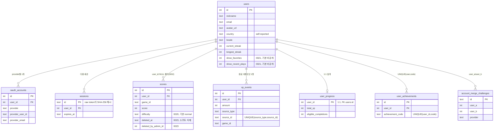
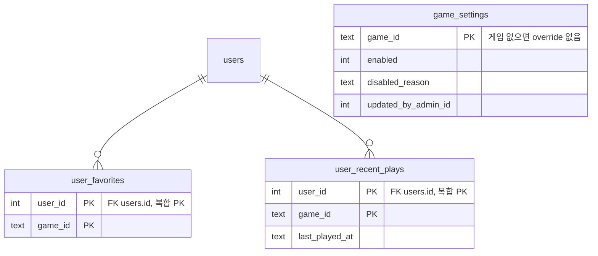
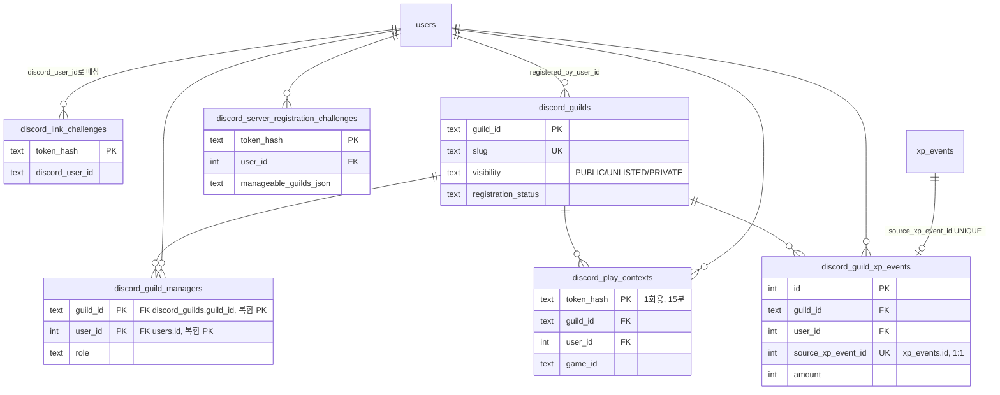
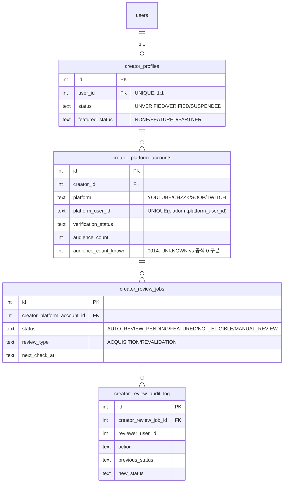
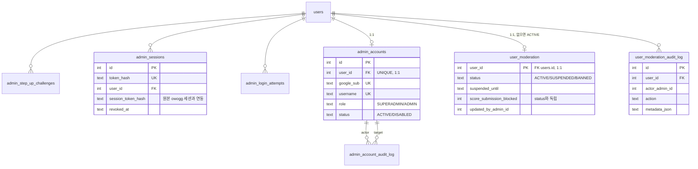

# OwOGG 데이터베이스 구조 및 ERD (DATABASE)

이 문서는 OwOGG의 Cloudflare D1(서버리스 SQLite) 스키마 전체 — 테이블 구조, ERD, 설계 관례 —
와 트래픽/데이터량이 크게 늘어날 때의 확장성 점검 결과를 정리합니다. 마이그레이션 원문은
[`packages/db/migrations/`](../packages/db/migrations/)(`0000`~`0023`)이 유일한 원천이며, 이
문서는 그 요약입니다 — 실제 컬럼/제약조건은 항상 마이그레이션 파일을 기준으로 확인하세요.

> ⚠️ **프로덕션 배포 상태(2026-08-15 `wrangler d1 execute ... d1_migrations` 실측)**: 이 문서는
> 저장소의 마이그레이션 전체(`0000`~`0023`, 로컬 D1 기준)를 설명합니다. 프로덕션 `owogg-d1`은
> 현재 `0021_profile_visibility.sql`까지만 적용된 상태이며, `0022`(모니터링 인덱스)와
> `0023`(`user_moderation`/`user_moderation_audit_log`, `scores` 소프트 삭제 컬럼)은 아직 코드가
> 커밋/배포되지 않아 미적용입니다. `.github/workflows/deploy.yml`이 `pnpm d1:migrate:prod`를 API
> 배포보다 먼저 실행하므로 정상적인 `git push` → CI/CD 경로로 배포하면 자동으로 따라잡히지만,
> **이 두 마이그레이션에 의존하는 코드(`/admin/monitoring`, `/admin/users`,
> `D1SessionRepository`의 `user_moderation` LEFT JOIN)를 CI/CD를 건너뛰고 수동 배포하면 안 됩니다**
> — `user_moderation` 테이블이 없는 프로덕션에 그 코드가 나가면 로그인 세션 조회(`findSession`)
> 자체가 매 요청 실패합니다.

---

## 1. 🗄️ 전체 구조 개요

- **엔진**: Cloudflare D1 — SQLite 기반 서버리스 DB. 리전 하나의 **단일 쓰기 프라이머리** + 전
  세계 리드 리플리카 구조입니다. 전통적인 다중 프라이머리 분산 DB가 아닙니다. 프로덕션
  `owogg-d1`은 Global Read Replication이 **이미 활성화**되어 있음을 `wrangler d1 info`로
  확인했습니다(`read_replication.mode: auto`, 2026-08-15) — 공개 읽기 경로가 D1 Sessions
  API(`apps/api/src/readReplica.ts`)를 쓰면 이 리플리카를 실제로 활용합니다.
- **접근 방식**: 어떤 라우트도 SQL을 직접 실행하지 않습니다 — `apps/api/src/routes/*`(Thin
  Controller) → `packages/core`(UseCases, 도메인 규칙) → Repository 포트 인터페이스 →
  `packages/db/src/d1/D1*Repository.ts`(실제 SQL) 순서로만 접근합니다
  (`docs/ARCHITECTURE.md` 참고). 게임 카탈로그 정책(`GAME_MANIFEST_MAP`)은 D1 레이어와 100%
  분리되어 있습니다.
- **현재 24개 마이그레이션**(`0000`~`0023`)이 아래 8개 도메인 영역, 총 28개 테이블을 구성합니다
  (2026-08-15 `wrangler d1 execute ... sqlite_master`로 로컬 D1 실측 검증 — `sqlite_sequence`,
  `d1_migrations`, `_cf_METADATA` 같은 SQLite/D1 내부 테이블은 제외한 애플리케이션 테이블 수).

| 영역            | 마이그레이션                   | 테이블                                                                                                                                                              |
| :-------------- | :----------------------------- | :------------------------------------------------------------------------------------------------------------------------------------------------------------------ |
| 계정/인증       | `0000`, `0003`, `0004`         | `users`, `oauth_accounts`, `sessions`, `account_merge_challenges`                                                                                                   |
| 점수/진행도(XP) | `0000`, `0002`, `0005`, `0020` | `scores`, `xp_events`, `user_progress`, `user_achievements`                                                                                                         |
| 개인화          | `0001`                         | `user_favorites`, `user_recent_plays`                                                                                                                               |
| Discord         | `0006`~`0009`                  | `discord_link_challenges`, `discord_guilds`, `discord_guild_managers`, `discord_server_registration_challenges`, `discord_play_contexts`, `discord_guild_xp_events` |
| Creator         | `0010`~`0014`                  | `creator_profiles`, `creator_platform_accounts`, `creator_review_jobs`, `creator_review_audit_log`                                                                  |
| 관리자 인증     | `0015`, `0016`                 | `admin_step_up_challenges`, `admin_sessions`, `admin_login_attempts`, `admin_accounts`, `admin_account_audit_log`                                                   |
| 게임 운영       | `0019`                         | `game_settings`                                                                                                                                                     |
| 유저 제재       | `0023`                         | `user_moderation`, `user_moderation_audit_log`                                                                                                                      |

---

## 2. 📊 ERD

가독성을 위해 영역별로 분리했습니다. `users.id`가 사실상 모든 도메인의 중심(허브) 외래키입니다.

### 2.1 계정/인증 & 점수/진행도(XP) — 핵심 도메인

**불변식**: `scores.user_id`는 NULL 불가(게스트 랭킹은 제거됨, `0002`). `xp_events`는
`UNIQUE(source_type, source_id)`로 같은 완료 이벤트가 두 번 XP를 만들지 못하게 막는 멱등성
원장입니다. `user_progress`는 `xp_events`의 파생 집계일 뿐 그 자체가 진실의 원천이 아닙니다.

### 2.2 개인화 & 게임 운영

`game_settings`는 `users`를 참조하지 않는 독립 테이블입니다(게임 카탈로그 대상 override).

### 2.3 Discord 연동

**핵심 불변식**(`docs/DISCORD_INTEGRATION.md` 참고): 글로벌 XP·길드별 유저 XP·길드 전체 활동
XP는 서로 다른 개념이며, `discord_guild_xp_events.source_xp_event_id UNIQUE`가 "글로벌 XP
이벤트 1개는 길드 귀속을 최대 1개만 가진다"를 강제합니다. 길드 내 유저별/전체 XP는 별도 집계
컬럼 없이 이 원장을 그때그때 합산합니다(archive 문서 참고).

### 2.4 Creator(크리에이터) 시스템

`creator_review_audit_log`는 UPDATE/DELETE 트리거로 보호되는 append-only 감사 원장입니다.

### 2.5 관리자 인증 & 유저 제재

`ADMIN_USER_IDS`(서버 설정, DB 밖)가 root 자격의 최종 근거이며, `admin_accounts`는 그 위에
얹힌 일상 운영용 계정 계층입니다(`docs/ADMIN_GUIDE.md`). `user_moderation`은 `game_settings`와
같은 "override가 있을 때만 행이 존재" 패턴 — 정지 이력이 없는 유저는 행 자체가 없습니다.

---

## 3. 🧩 반복되는 설계 관례

전체 스키마에서 일관되게 나타나는 패턴들입니다 — 새 테이블을 추가할 때도 따라야 합니다.

1. **1회용 챌린지 토큰은 해시로만 저장**: `discord_link_challenges`, `admin_step_up_challenges`,
   `admin_sessions`, `account_merge_challenges` 등 모든 토큰 계열 테이블은 원문이 아닌
   SHA-256/유사 해시(`token_hash`)만 저장하고 `expires_at`/`consumed_at`으로 1회성을 강제합니다.
2. **Append-only 감사 로그 + DB 트리거 보호**: `creator_review_audit_log`,
   `admin_account_audit_log`는 `BEFORE UPDATE`/`BEFORE DELETE` 트리거로 수정 자체를 DB
   레벨에서 차단합니다. `user_moderation_audit_log`(`0023`)는 트리거는 없지만 API에 수정/삭제
   경로 자체가 없습니다(애플리케이션 레벨 강제 — DB 트리거로 격상하는 것도 향후 검토 가능).
3. **"override 있을 때만 행 존재" 패턴**: `game_settings`, `user_moderation` — 정상/기본 상태는
   행이 아예 없는 것으로 표현하여 대다수 row에 대해 쓰기가 발생하지 않습니다.
4. **소프트 삭제 + 명시적 필터**: `scores.deleted_at`(`0023`)은 하드 삭제 대신 소프트 삭제를
   쓰고, 이를 읽는 모든 쿼리(`D1ScoreRepository`, `D1CreatorRepository`,
   `D1DiscordGuildRepository`, `D1AdminMonitoringRepository`)가 개별적으로
   `deleted_at IS NULL`을 추가합니다 — ORM이 아니므로 새 쿼리를 추가할 때 이 필터를 빠뜨리지
   않아야 합니다.
5. **원장(ledger) + 파생 집계 분리**: `xp_events`(원장) → `user_progress`(파생 집계),
   `discord_guild_xp_events`(원장) → 길드 XP(집계 컬럼 없이 그때그때 SUM). 집계 테이블이 있는
   경우도 원장이 항상 진실의 원천입니다.
6. **UNKNOWN vs 확정된 0 구분** (`0014`): 외부 API가 아직 응답하지 않은 값과 공식적으로 0을
   반환한 값을 같은 컬럼에 섞지 않고 별도 `_known` 플래그로 구분합니다.

---

## 4. ⚡ 확장성 및 트래픽/용량 점검

> **요약**: 현재 스키마와 인덱스는 무료 티어 규모(수천~수만 유저, 평소 트래픽)에서는 안전합니다.
> 다만 Cloudflare D1은 리전 하나의 **단일 쓰기 프라이머리** 구조라 전통적인 다중 프라이머리
> 분산 DB처럼 무한히 수평 확장되지 않으며, 무료 티어는 DB당 500MB 용량 상한이 있습니다. 인덱스
> 커버리지·리더보드 쿼리 설계 등 스키마 자체는 이번 점검에서 문제가 발견되지 않았습니다.
> 이용자 증가에 대응하는 구체적인 우선순위 조치(읽기 리플리카 도입, 요청당 쿼리 체인 축소,
> 유료 플랜 전환 시점 등)는 운영자 전용 상세 점검 문서로 별도 관리합니다 —
> `docs/archive/database-scalability-review-2026-08.md`(로컬 전용, 저장소에는 포함되지 않음).
> `/admin/monitoring`의 D1 헬스체크·DAU/WAU가 실제로 병목이 시작되는 시점을 포착하기 위한
> 지표이니 주기적으로 확인하는 것을 권장합니다.

---

## 5. 🔗 관련 문서

- **아키텍처 전반**: [`docs/ARCHITECTURE.md`](ARCHITECTURE.md)
- **진행도/XP 상세 규칙**: [`docs/PROGRESSION.md`](PROGRESSION.md)
- **Discord XP 귀속 불변식**: [`docs/DISCORD_INTEGRATION.md`](DISCORD_INTEGRATION.md),
  [`docs/archive/discord-integration-phase-history.md`](archive/discord-integration-phase-history.md)
- **Creator 심사 엔진 내부 동작**:
  [`docs/archive/creator-system-review-engine-detail.md`](archive/creator-system-review-engine-detail.md)
- **관리자 인증 구조**: [`docs/ADMIN_GUIDE.md`](ADMIN_GUIDE.md)
- **마이그레이션 원문**: [`packages/db/migrations/`](../packages/db/migrations/)
- **확장성/트래픽 점검 상세**(운영진 전용):
  `docs/archive/database-scalability-review-2026-08.md`

Sources: [D1 Limits](https://developers.cloudflare.com/d1/platform/limits/) ·
[D1 Global Read Replication](https://developers.cloudflare.com/d1/best-practices/read-replication/) ·
[Sequential consistency without borders (Cloudflare Blog)](https://blog.cloudflare.com/d1-read-replication-beta/)
