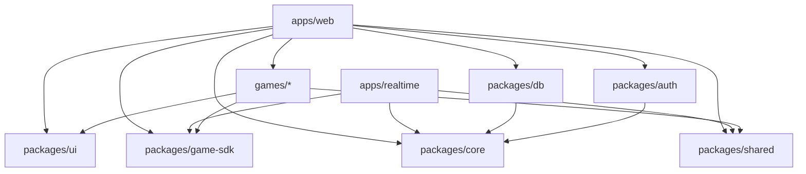

# GAMEMOA — Architecture & Vibe Coding Blueprint

> 기준일: 2026-08-12  
> 목적: 미니게임 모음 사이트 **gamemoa**를 AI 코딩 모델이 일관된 방향으로 구현할 수 있도록 하는 실행 가능한 설계 명세서  
> 현재 우선순위: **싱글 플레이 게임 확장 → 로컬 품질/테스트 안정화 → 기록/DB → 로그인/웹호스팅 → 멀티플레이**  
> 개발 전략: **로컬 우선(local-first)**. Cloudflare Workers는 목표 런타임으로 유지하지만 실제 웹 호스팅/production 배포와 OAuth 로그인은 후순위다.

---

## 현재 구현 상태 — 2026-08-12

`PROGRESS.md`와 `ARCHITECTURE.md`의 **완료 상태**를 기준으로 정리했다. 향후 Phase 순서는 이 Blueprint의 최신 로드맵을 우선한다:

```text
Phase 0 Repository Foundation       ✅ 완료
Phase 1 Web Shell / Landing / UI    ✅ 완료
Phase 2 Game SDK + Reaction Time    ✅ 완료 (Reaction Time unit test 19개 통과)
다음 우선순위                        ▶ 추가 싱글 플레이 게임 + 로컬 품질 안정화
```

현재 운영 원칙:

- 기존 Phase 0~2를 다시 scaffold하지 않는다.
- 현재 저장소의 구현을 읽고 이어서 확장한다.
- **웹 호스팅/production 배포는 후순위**다.
- **Google/Discord 로그인도 후순위**다.
- 사용자 요청 없이 production Cloudflare resource, OAuth secret, realtime infrastructure를 만들지 않는다.
- Windows에서 발생했던 `esbuild` 상위 디렉터리 접근 문제의 workaround를 새 프로젝트에 자동 복제하지 않는다.
- 새 Windows 프로젝트는 짧은 SSD 경로(예: `F:\dev\<project>`)를 우선하고, `subst X:` 같은 가상 드라이브는 진단 후 임시 workaround로만 사용한다.

---

## 0. 모델에게 주는 최우선 지시

이 문서는 단순 제안서가 아니라 구현 규칙이다.

### MUST

1. TypeScript `strict`를 유지한다.
2. 게임은 `games/*` 단위의 독립 패키지로 추가한다.
3. 개별 게임은 `apps/web` 내부 구현을 직접 import하지 않는다.
4. 공통 계약은 `packages/game-sdk`에 정의한다.
5. Cloudflare 종속 코드는 adapter/infrastructure 계층에 가둔다.
6. 현재 Phase에서는 게임 확장과 로컬 안정화를 우선하며, **로그인/production 배포는 사용자가 명시적으로 요청하기 전까지 구현하지 않는다.**
7. 인증 Phase에 진입하면 Better Auth를 사용하고 **Google + Discord만 노출**하며 이메일/비밀번호 로그인은 구현하지 않는다.
8. 사용자 입력, API payload, 게임 score payload는 Zod로 런타임 검증한다.
9. 멀티플레이 서버 상태를 브라우저를 신뢰해 판정하지 않는다.
10. DB Phase에 진입한 뒤 스키마 변경은 migration 파일로만 수행한다.
11. production migration이 실제로 시작되면 backward-compatible한 **expand → deploy → contract** 방식을 사용한다.
12. 모든 변경은 적용 가능한 lint/typecheck/test/build를 통과해야 한다.
13. `main` 직접 push를 금지하고 GitHub branch protection을 사용한다.
14. production secret은 Git에 저장하지 않는다.
15. production 배포 Phase에 진입하면 CI/CD 배포 주체는 GitHub Actions 하나로 통일하고 Cloudflare Workers Builds의 자동 production deploy는 끈다.

### SHOULD

- 새 기능보다 기존 경계와 계약을 먼저 재사용한다.
- 게임별 번들을 lazy-load한다.
- 게임 엔진 라이브러리는 필요한 게임 패키지 안에서만 의존한다.
- 서버 API는 versioned route(`/api/v1/...`)를 사용한다.
- UI 공통 컴포넌트는 접근성을 우선한다.
- 기능 플래그로 미완성 게임/멀티플레이를 숨긴다.
- 로그에 request id / user id(가능한 경우) / game id를 구조화하여 남긴다.

### MUST NOT

- 전역 mutable singleton에 게임 상태를 넣지 않는다.
- `any`로 타입 오류를 우회하지 않는다.
- 게임마다 인증/DB 접근 로직을 복제하지 않는다.
- OAuth client secret을 클라이언트 번들에 노출하지 않는다.
- PR Preview에서 production D1을 바인딩하지 않는다.
- 브라우저가 제출한 최종 점수를 검증 없이 랭킹에 저장하지 않는다.
- 하나의 거대한 `utils.ts`, `components.tsx`, `api.ts` 파일로 기능을 몰아넣지 않는다.

---

# 1. 제품 정의

## 1.1 한 줄 정의

**gamemoa는 설치 없이 바로 즐기는 가벼운 웹 미니게임 모음 플랫폼이다.**

## 1.2 현재 1차 목표 — 로컬 싱글 플레이 제품 완성도

- 랜딩페이지와 게임 탐색 유지/개선
- 싱글 플레이 게임 수 확장
- Reaction Time 포함 각 게임의 완성도 개선
- 공통 GameShell / Game SDK 재사용성 강화
- 반응형 웹
- 접근성
- 오류/로딩/빈 상태
- 로컬 개발 경험 안정화
- lint / typecheck / test / build 안정화

## 1.3 후속 목표 — 서버 기능 / 운영

순서는 제품 필요에 따라 조정할 수 있지만 기본 우선순위는 다음이다.

1. D1 + Drizzle 기반 기록/점수/랭킹
2. 최근 플레이 / 개인 최고 기록 / 즐겨찾기
3. Better Auth 기반 Google + Discord 로그인
4. 기본 프로필
5. Cloudflare 웹 호스팅 / staging / production CI/CD
6. 로컬 멀티
7. 온라인 방 생성/참가
8. 초대 링크 / 실시간 상태 동기화
9. 시즌 랭킹 / 업적 / 친구 / 추천 / 관리자 도구

## 1.4 비목표(MVP)

- 자체 비밀번호 인증
- 결제
- 게임 제작자 마켓플레이스
- UGC 스크립트 실행
- 복잡한 소셜 그래프
- MMR
- 안티치트 완성형 시스템
- 마이크로서비스 다중 분리

---

# 2. 핵심 아키텍처 결정

## 2.1 전체 형태

**Modular Monolith + Game Plugin Architecture + Cloudflare Edge Adapter**

현재는 **로컬 개발 가능한 web app + game packages**를 중심으로 운용한다. Cloudflare Edge Adapter는 목표 아키텍처로 유지하되 production hosting은 후순위다.

초기에는 서비스 수를 늘리지 않는다.

- `apps/web`: 웹 UI + SSR/route action/loader + HTTP API
- `apps/realtime`: 온라인 멀티플레이 전용 Worker/Durable Objects
- `packages/*`: 공통 계약/도메인/인프라
- `games/*`: 게임 플러그인

`apps/realtime`은 초기 싱글게임 MVP에서 배포하지 않아도 된다.

## 2.2 왜 웹과 realtime Worker를 분리하는가

1. 싱글게임 중심 MVP를 단순하게 유지
2. 멀티플레이 장애가 웹 전체에 전파되는 범위 축소
3. Durable Objects를 별도 scaling/failure domain으로 격리
4. 웹 Worker의 PR Preview URL을 유지
5. realtime worker만 별도로 부하 테스트 가능
6. 이후 다른 realtime 기술로 이동할 때 UI/게임 계약 영향 최소화

## 2.3 의존성 방향



금지되는 방향:

```text
games/* -> apps/web
games/* -> apps/realtime
packages/core -> Cloudflare implementation
packages/shared -> feature-specific code
```

---

# 3. 추천 기술 스택

## 3.1 언어 / 런타임

| 영역                   | 선택                      |
| ---------------------- | ------------------------- |
| Application language   | TypeScript                |
| Browser                | Modern evergreen browsers |
| Server runtime         | Cloudflare Workers        |
| Package manager        | pnpm                      |
| Monorepo orchestration | Turborepo                 |
| Module format          | ESM                       |

TypeScript 설정:

```json
{
  "compilerOptions": {
    "strict": true,
    "noUncheckedIndexedAccess": true,
    "exactOptionalPropertyTypes": true,
    "noImplicitOverride": true,
    "useUnknownInCatchVariables": true
  }
}
```

## 3.2 웹

- React
- React Router Framework Mode
- Vite
- Cloudflare Vite Plugin
- Tailwind CSS
- shadcn/ui는 **소스 복사형 UI scaffold 용도만**
- Radix 계열 primitive는 접근성 기본 구성에 활용 가능
- Lucide 아이콘

원칙:

- 서버 데이터는 React Router loader/action을 우선한다.
- 단순히 서버 상태 캐시가 필요하다는 이유만으로 TanStack Query를 즉시 추가하지 않는다.
- background refresh/polling/optimistic mutation 요구가 커질 때 TanStack Query를 도입한다.

## 3.3 상태 관리

### 상태 분류

1. URL state → React Router
2. 서버 영속 상태 → loader/action/API
3. 페이지 UI 상태 → local React state
4. 여러 컴포넌트에 걸친 transient client state → Zustand
5. 게임 내부 state → 해당 게임 모듈 내부
6. 온라인 authoritative state → Durable Object

Zustand를 모든 상태의 기본 저장소로 사용하지 않는다.

## 3.4 데이터

> **현재 상태: 후속 Phase.** 추가 게임/로컬 안정화가 우선이며, 데이터 영속성이 실제 작업 목표가 되기 전에는 스키마를 확장하지 않는다.

- Cloudflare D1
- Drizzle ORM
- Drizzle Kit migrations
- Zod

초기 D1 대상:

- user/profile 연결 정보
- game metadata의 운영 데이터(필요 시)
- play session summary
- personal best
- leaderboard entry
- favorite
- achievement(후속)
- moderation/audit metadata(후속)

정적 게임 manifest는 DB가 아니라 코드 registry로 시작한다.

## 3.5 인증

> **현재 상태: 후순위.** 사용자가 로그인 구현을 명시적으로 요청하기 전에는 OAuth provider 연결, secret 설정, 로그인 UI 확장을 진행하지 않는다.

- Better Auth
- Google OAuth
- Discord OAuth
- D1 persistence

초기 로그인 UI는 정확히 다음 2개만 노출:

```text
[ Google로 계속하기 ]
[ Discord로 계속하기 ]
```

추후 provider 추가 시 UI 배열과 server provider config를 확장한다.

## 3.6 멀티플레이

- Cloudflare Durable Objects
- WebSocket Hibernation API
- 메시지 schema: Zod
- authoritative room state
- client prediction은 게임별 선택
- protocol version 필수

온라인 멀티플레이는 게임마다 선택적으로 구현한다.

## 3.7 테스트

- Vitest
- Cloudflare Workers Vitest integration
- React Testing Library
- Playwright
- MSW는 브라우저 API mock이 복잡해질 때 선택 도입

테스트 피라미드:

```text
많음   pure unit / game rules
중간   integration / D1 / Worker bindings
적음   Playwright critical flow
최소   real OAuth manual/scheduled smoke
```

## 3.8 코드 품질

- ESLint
- Prettier
- TypeScript compiler
- dependency boundary lint rule
- Changesets는 외부 패키지 배포를 시작할 때 도입

---

# 4. 저장소 구조

```text
gamemoa/
├─ apps/
│  ├─ web/
│  │  ├─ app/
│  │  │  ├─ components/
│  │  │  ├─ features/
│  │  │  │  ├─ auth/
│  │  │  │  ├─ catalog/
│  │  │  │  ├─ favorites/
│  │  │  │  ├─ leaderboard/
│  │  │  │  └─ profile/
│  │  │  ├─ routes/
│  │  │  ├─ server/
│  │  │  │  ├─ api/
│  │  │  │  ├─ middleware/
│  │  │  │  └─ services/
│  │  │  ├─ styles/
│  │  │  ├─ entry.client.tsx
│  │  │  ├─ entry.server.tsx
│  │  │  ├─ root.tsx
│  │  │  └─ routes.ts
│  │  ├─ public/
│  │  ├─ tests/
│  │  ├─ vite.config.ts
│  │  └─ wrangler.jsonc
│  │
│  └─ realtime/
│     ├─ src/
│     │  ├─ rooms/
│     │  ├─ protocol/
│     │  ├─ matchmaking/
│     │  ├─ index.ts
│     │  └─ env.d.ts
│     ├─ tests/
│     └─ wrangler.jsonc
│
├─ packages/
│  ├─ auth/
│  │  ├─ src/
│  │  │  ├─ server.ts
│  │  │  ├─ client.ts
│  │  │  ├─ providers.ts
│  │  │  └─ index.ts
│  │  └─ package.json
│  │
│  ├─ core/
│  │  ├─ src/
│  │  │  ├─ domain/
│  │  │  ├─ ports/
│  │  │  ├─ use-cases/
│  │  │  └─ errors/
│  │  └─ package.json
│  │
│  ├─ db/
│  │  ├─ src/
│  │  │  ├─ schema/
│  │  │  ├─ repositories/
│  │  │  ├─ client.ts
│  │  │  └─ index.ts
│  │  ├─ migrations/
│  │  ├─ drizzle.config.ts
│  │  └─ package.json
│  │
│  ├─ game-sdk/
│  │  ├─ src/
│  │  │  ├─ contracts/
│  │  │  ├─ events/
│  │  │  ├─ multiplayer/
│  │  │  ├─ scoring/
│  │  │  └─ index.ts
│  │  └─ package.json
│  │
│  ├─ ui/
│  │  ├─ src/
│  │  │  ├─ components/
│  │  │  ├─ game-shell/
│  │  │  └─ tokens/
│  │  └─ package.json
│  │
│  ├─ shared/
│  │  ├─ src/
│  │  │  ├─ schemas/
│  │  │  ├─ types/
│  │  │  ├─ utils/
│  │  │  └─ constants/
│  │  └─ package.json
│  │
│  └─ config/
│     ├─ eslint/
│     ├─ typescript/
│     └─ tailwind/
│
├─ games/
│  ├─ reaction-time/
│  │  ├─ src/
│  │  │  ├─ game.tsx
│  │  │  ├─ manifest.ts
│  │  │  ├─ rules.ts
│  │  │  ├─ scoring.ts
│  │  │  └─ index.ts
│  │  ├─ assets/
│  │  ├─ tests/
│  │  └─ package.json
│  └─ ...
│
├─ docs/
│  ├─ adr/
│  ├─ product/
│  └─ runbooks/
│
├─ .github/
│  ├─ workflows/
│  ├─ CODEOWNERS
│  └─ pull_request_template.md
│
├─ AGENTS.md
├─ pnpm-workspace.yaml
├─ turbo.json
├─ package.json
└─ README.md
```

---

# 5. 게임 플러그인 아키텍처

## 5.1 목표

새 게임을 추가할 때 플랫폼 코드를 수정하는 범위를 최소화한다.

이상적인 새 게임 추가:

1. `games/<slug>` 생성
2. manifest 작성
3. `Game` component 구현
4. score strategy 구현
5. registry에 1줄 등록
6. 테스트 추가

## 5.2 Game manifest

```ts
export type GameMode = "single" | "local-multi" | "online-multi";

export type GameStatus = "draft" | "beta" | "published" | "hidden";

export interface GameManifest {
  id: string;
  slug: string;
  title: string;
  shortDescription: string;
  description: string;

  modes: readonly GameMode[];
  status: GameStatus;

  categories: readonly string[];
  tags: readonly string[];

  minPlayers: number;
  maxPlayers: number;

  thumbnail: string;
  accent?: string;

  estimatedRoundSeconds?: number;
  requiresAuth: boolean;
  supportsLeaderboard: boolean;

  version: string;
}
```

## 5.3 Game module contract

```ts
import type { ComponentType } from "react";

export interface GameRuntimeContext {
  sessionId: string;
  user: {
    id: string;
    displayName: string;
  } | null;

  emit: (event: GameClientEvent) => void;
  complete: (result: GameResult) => Promise<void>;
  cancel: () => void;
}

export interface GameProps {
  runtime: GameRuntimeContext;
}

export interface GameModule {
  manifest: GameManifest;
  Game: ComponentType<GameProps>;
  validateResult?: (result: GameResult) => Promise<GameResultValidation>;
}
```

## 5.4 등록

```ts
export const gameRegistry = {
  "reaction-time": () => import("@gamemoa/game-reaction-time"),
  "memory-card": () => import("@gamemoa/game-memory-card"),
} satisfies Record<string, () => Promise<GameModule>>;
```

반드시 dynamic import를 사용해 게임 코드를 route 단위로 분리한다.

## 5.5 엔진 독립성

게임은 React component 계약만 만족하면 내부 구현은 자유롭다.

예:

```text
간단 UI 게임 -> React
Canvas 게임 -> React wrapper + Canvas 2D
복잡한 2D -> React wrapper + Phaser/PixiJS
3D -> React wrapper + Three.js
```

플랫폼 전체에 Phaser/Pixi/Three를 설치하지 않는다.
필요한 게임 패키지만 해당 엔진을 dependency로 가진다.

---

# 6. 게임 런타임 설계

## 6.1 상태 머신

공통 shell의 상태:

```text
idle
  ↓
loading
  ↓
ready
  ↓
playing
  ↓
submitting
  ↓
result
  ↘ error
```

게임별 내부 상태는 별도로 가진다.

## 6.2 공통 GameShell 책임

`packages/ui/src/game-shell`:

- fullscreen / responsive container
- escape/back behavior
- pause 지원 여부 표시
- login 상태
- game title
- sound toggle
- retry
- result modal
- score submit status
- share
- keyboard focus boundary
- error boundary

게임 자체는 shell UI를 재구현하지 않는다.

## 6.3 공통 이벤트

```ts
type GameClientEvent =
  | { type: "game_started"; at: number }
  | { type: "checkpoint"; name: string; at: number }
  | { type: "game_completed"; at: number }
  | { type: "game_abandoned"; at: number };
```

분석 이벤트와 도메인 이벤트를 구분한다.

---

# 7. 점수/랭킹 설계

## 7.1 점수 모델

```ts
export interface GameResult {
  gameId: string;
  sessionId: string;
  score: number;
  durationMs: number;
  metadata?: Record<string, unknown>;
  clientStartedAt: number;
  clientEndedAt: number;
}
```

## 7.2 score strategy

게임별로 비교 규칙이 다르다.

```ts
export interface ScoreStrategy {
  order: "higher-is-better" | "lower-is-better";
  normalize(score: number): number;
  format(score: number): string;
}
```

예:

- 클릭 수: lower-is-better
- 반응속도 ms: lower-is-better
- 획득 점수: higher-is-better

## 7.3 부정 점수 최소 방어

MVP:

- signed server game session id
- session createdAt/expiresAt
- 결과 제출 횟수 제한
- duration sanity check
- score range validation
- game-specific validator
- impossible state reject
- rate limit
- suspicious flag

랭킹 경쟁성이 높아지면:

- deterministic replay
- input log validation
- server authoritative simulation
- anomaly detection

---

# 8. 인증 설계

> **Deferred:** 이 장은 향후 로그인 Phase용 목표 설계다. 현재 싱글 플레이/로컬 품질 작업에서는 구현하지 않는다.

## 8.1 provider

초기:

```ts
socialProviders: {
  google: {...},
  discord: {...},
}
```

UI provider 배열:

```ts
export const enabledAuthProviders = ["google", "discord"] as const;
```

추후 추가는 배열/config 확장으로 해결한다.

## 8.2 route

```text
/api/auth/*
```

Better Auth handler를 route adapter에서 연결한다.

## 8.3 user/profile 분리

인증 라이브러리의 user 테이블을 product profile과 동일시하지 않는다.

권장:

```text
auth user
  1:1
gamemoa profile
```

`profiles` 예시:

```text
user_id
display_name
avatar_url
bio
locale
created_at
updated_at
```

장점:

- auth provider 교체 가능
- 게임 닉네임 정책 분리
- moderation 확장 용이

## 8.4 OAuth 환경

### local

```text
http://localhost:5173/api/auth/callback/google
http://localhost:5173/api/auth/callback/discord
```

실제 dev port는 프로젝트 설정과 provider 등록을 일치시킨다.

### staging

고정 URL 사용:

```text
https://staging.example-domain/api/auth/callback/google
https://staging.example-domain/api/auth/callback/discord
```

### production

```text
https://gamemoa.example/api/auth/callback/google
https://gamemoa.example/api/auth/callback/discord
```

### PR Preview

동적 PR URL에서는 real OAuth smoke를 요구하지 않는다.

이유:

- provider redirect URI를 모든 동적 URL마다 관리하는 것은 운영 복잡도를 크게 높인다.
- PR에서는 auth UI와 session abstraction을 test fixture로 검증한다.
- real OAuth는 고정 staging URL에서 검증한다.

---

# 9. DB 스키마 초안

```text
profiles
- user_id PK/FK
- display_name
- avatar_url
- locale
- created_at
- updated_at

game_sessions
- id PK
- game_id
- user_id nullable
- mode
- status
- started_at
- ended_at
- server_nonce
- result_hash nullable

scores
- id PK
- game_session_id UNIQUE
- game_id
- user_id
- score
- normalized_score
- duration_ms
- metadata_json
- suspicious
- created_at

personal_bests
- user_id
- game_id
- score_id
- normalized_score
- updated_at
PRIMARY KEY(user_id, game_id)

favorites
- user_id
- game_id
- created_at
PRIMARY KEY(user_id, game_id)

play_history
- id PK
- user_id
- game_id
- session_id
- played_at
```

인덱스:

```text
scores(game_id, normalized_score, created_at)
scores(user_id, game_id, created_at)
game_sessions(user_id, started_at)
play_history(user_id, played_at)
```

`normalized_score`는 모든 게임에서 정렬 방향을 통일하기 위해 사용할 수 있다.

예:

```text
higher-is-better: normalized = score
lower-is-better : normalized = -score
```

랭킹 query는 `normalized_score DESC`.

---

# 10. API 설계

## 10.1 원칙

- browser-facing internal API는 `/api/v1`
- 입력 Zod validation
- 공통 error envelope
- request id
- auth middleware
- idempotency가 필요한 endpoint는 명시

## 10.2 endpoint 예시

```text
GET    /api/v1/games
GET    /api/v1/games/:slug
POST   /api/v1/games/:slug/sessions
POST   /api/v1/games/:slug/sessions/:sessionId/result
GET    /api/v1/games/:slug/leaderboard
GET    /api/v1/me
GET    /api/v1/me/history
GET    /api/v1/me/favorites
PUT    /api/v1/me/favorites/:gameId
DELETE /api/v1/me/favorites/:gameId
```

## 10.3 error envelope

```ts
type ApiError = {
  error: {
    code: string;
    message: string;
    requestId: string;
    details?: unknown;
  };
};
```

클라이언트가 HTTP message string을 파싱해 로직을 결정하지 않는다.
`code`를 사용한다.

---

# 11. 멀티플레이 확장 설계

## 11.1 room model

Durable Object instance 하나를 room 하나로 본다.

```text
Room ID -> Durable Object ID
```

room 책임:

- 참가자 연결
- ready 상태
- authoritative game state
- sequence number
- heartbeat
- reconnect
- room expiration
- winner/result
- server events

## 11.2 protocol

모든 메시지에 버전을 넣는다.

```ts
type ClientMessage =
  | {
      v: 1;
      type: "join";
      roomId: string;
      token: string;
    }
  | {
      v: 1;
      type: "input";
      seq: number;
      payload: unknown;
    };

type ServerMessage =
  | {
      v: 1;
      type: "snapshot";
      tick: number;
      state: unknown;
    }
  | {
      v: 1;
      type: "event";
      seq: number;
      event: unknown;
    };
```

Zod discriminated union으로 검증한다.

## 11.3 authoritative rule

```text
client:
"내가 이겼다"
    X

client:
"나는 이 input을 이 시점에 보냈다"
    ↓

server:
rule simulation / validation
    ↓

server:
result
```

## 11.4 reconnect

room participant:

```text
connectionId
userId
lastAckSeq
lastSeenAt
status
```

재접속 시 snapshot + missing events를 보낸다.

---

# 12. Landing Page 명세

## 12.1 목표

첫 방문자가 5초 안에 알아야 하는 것:

1. 게임 모음 사이트
2. 설치 불필요
3. 바로 플레이 가능
4. 로그인하면 기록 저장
5. 멀티플레이도 확장 예정

## 12.2 정보 구조

```text
Header
Hero
Featured Games
Why Gamemoa
Categories
Ranking / Challenge teaser
Multiplayer teaser
Login CTA
Footer
```

## 12.3 Header

왼쪽:

```text
gamemoa
```

중앙/desktop:

```text
게임
랭킹
```

오른쪽:

```text
검색
로그인
```

로그인 상태:

```text
프로필 아바타
```

## 12.4 Hero copy

### Eyebrow

```text
PLAY. SCORE. AGAIN.
```

### H1

```text
심심할 틈 없이,
게임을 한곳에.
```

### Sub copy

```text
설치 없이 바로 즐기는 가벼운 미니게임.
짧게 한 판, 기록을 깨고, 다시 도전하세요.
```

### Primary CTA

```text
지금 바로 플레이
```

### Secondary CTA

```text
게임 둘러보기
```

## 12.5 Featured Games

제목:

```text
지금 뭐 할까?
```

설명:

```text
고민할 필요 없이 바로 시작할 수 있는 게임들.
```

카드 표시:

- thumbnail
- title
- one-line description
- mode badge
- estimated playtime
- play button

## 12.6 Why Gamemoa

### 설치 없이

```text
브라우저만 열면 끝.
다운로드도 업데이트도 필요 없어요.
```

### 짧고 가볍게

```text
1분이든 10분이든,
원할 때 한 판만 즐겨도 충분해요.
```

### 기록에 도전

```text
로그인하면 최고 기록과 플레이 이력을 남길 수 있어요.
```

## 12.7 Multiplayer teaser

제목:

```text
혼자도 좋지만,
같이 하면 더 재밌으니까.
```

본문:

```text
친구와 바로 입장할 수 있는 온라인 멀티게임도 준비합니다.
한 링크로 모이고, 바로 시작하는 경험을 목표로 합니다.
```

badge:

```text
COMING SOON
```

## 12.8 Login CTA

```text
오늘의 기록을 남겨볼까요?
Google 또는 Discord로 로그인하고
최고 기록과 즐겨찾기를 저장하세요.
```

buttons:

```text
Google로 계속하기
Discord로 계속하기
```

## 12.9 디자인 방향

키워드:

```text
playful
clean
fast
arcade-lite
not childish
dark-first
high contrast
rounded
micro-interactions
```

권장:

- 기본 dark theme
- 강한 브랜드 accent 1개
- 게임 썸네일이 색을 담당
- shell chrome은 중성색
- border radius는 과하게 둥글지 않게
- hover 시 2~4px lift
- CTA animation은 150~220ms
- `prefers-reduced-motion` 준수
- canvas 영역과 UI 영역 대비 명확히 구분

모바일 우선.

---

# 13. 접근성

MUST:

- keyboard navigation
- visible focus ring
- semantic button/link
- image alt
- dialog focus trap
- reduced motion
- color만으로 상태 표시 금지
- 게임 규칙에 키보드 대체 입력 고려

실시간/반응속도 게임처럼 접근성 대체가 어려운 경우 manifest에 제한 사항을 명시한다.

---

# 14. 성능

## 목표

- landing JS를 게임 코드가 부풀리지 않아야 함
- 게임 route 진입 시 해당 game chunk만 load
- 썸네일/이미지 lazy loading
- 불필요한 client hydration 최소화
- canvas asset preload는 game route 이후
- large engine은 game package 안에서 dynamic import

## 예산

초기 실무 목표:

```text
Landing initial JS: 가능한 작게 유지
Game engine: game-specific chunk
Hero media: compressed responsive asset
Webfont: 최대 1 family, 필요한 weight만
```

정확한 KB 숫자는 실제 첫 게임 구현 후 Lighthouse/번들 분석으로 고정한다.

---

# 15. 보안

## MUST

- OAuth secrets → Cloudflare secrets
- production/staging 분리
- `BETTER_AUTH_SECRET` 환경별 분리
- CSP
- secure cookie
- same-site 정책 검토
- request body size limit
- Zod runtime validation
- score abuse rate limit
- admin route authorization
- unsafe HTML 금지
- 외부 URL allowlist
- log에서 token/secret/session cookie 제거

## Turnstile

다음 시점부터 고려:

- 공개 피드백 폼
- 반복 score abuse
- invite spam
- user-generated action

Turnstile client token만 보고 통과시키지 말고 server-side validation을 수행한다.

---

# 16. Cloudflare 리소스

> **Deferred 운영 인프라:** 현재는 로컬 개발이 기본이다. 실제 resource 생성/바인딩/production 배포는 사용자가 웹 호스팅 작업을 시작하라고 명시한 뒤 수행한다.

## MVP

```text
Workers
D1
Workers Logs / Observability
```

## 필요할 때

```text
Durable Objects -> online multiplayer
R2              -> 큰 game assets / user assets
KV              -> rarely changing config/cache
Turnstile       -> abuse protection
Analytics Engine-> high-cardinality product/game telemetry
Queues          -> async jobs가 생길 때
```

"Cloudflare에 있으니까"라는 이유만으로 리소스를 추가하지 않는다.

---

# 17. Observability

로그 포맷 예:

```json
{
  "level": "info",
  "event": "score_submitted",
  "requestId": "...",
  "gameId": "reaction-time",
  "userId": "...",
  "sessionId": "...",
  "durationMs": 231,
  "environment": "production"
}
```

절대 로그 금지:

```text
OAuth access token
OAuth refresh token
session cookie
client secret
BETTER_AUTH_SECRET
raw authorization header
```

핵심 지표:

```text
request error rate
p50/p95 latency
game start
game complete
game abandon
score reject
login success/failure
room create
room reconnect
websocket disconnect
```

---

# 18. CI/CD 설계

> **현재 적용 범위:** CI의 lint/typecheck/test/build 안정화는 계속 유지한다. staging/production deploy, production D1 migration, OAuth smoke, Cloudflare secret 연결은 웹 호스팅 Phase까지 보류한다.

## 18.1 Git 전략

```text
main = release branch
feature/* = 작업 branch
fix/* = 수정 branch
```

`main`:

- protected
- direct push 금지
- PR 필수
- required checks 필수
- 1인 프로젝트라도 CI check는 필수

## 18.2 CI 책임

모든 PR:

```text
install
lint
typecheck
unit/integration tests
build
Playwright critical e2e
migration file validation
dependency audit (advisory initially)
```

## 18.3 PR Preview

PR마다:

```text
wrangler versions upload --env staging --preview-alias pr-<number>
```

단, 이 Worker는 **Durable Object를 직접 구현하지 않는 web Worker**여야 한다.

PR preview DB:

- production DB 사용 금지
- staging D1 사용
- destructive migration 자동 적용 금지

PR preview auth:

- real Google/Discord OAuth 필수 검증 대상 아님
- auth test fixture 또는 logged-out 상태 중심
- real OAuth는 stable staging에서 수행

## 18.4 Release pipeline

`main` merge 후:

```text
1. CI 재검증
2. staging D1 migration
3. staging Worker version upload/deploy
4. staging smoke test
5. stable staging OAuth smoke
6. GitHub Environment: production 승인 gate
7. production D1 expand migration
8. production Worker version upload
9. version preview smoke
10. production deploy
11. production smoke
12. deployment metadata 기록
```

개인 프로젝트에서 승인 gate가 불필요하면 6을 자동화해도 된다.

## 18.5 Migration 규칙

DB는 Worker version rollback과 함께 자동 rollback되지 않는다.

따라서:

### 잘못된 변경

release A:

```sql
ALTER TABLE users DROP COLUMN old_name;
```

동시에 app이 새 column만 기대.

app rollback 시 깨질 수 있다.

### 올바른 변경

Release A:

```text
새 column 추가
app이 old/new 둘 다 처리
```

backfill:

```text
데이터 이동
```

Release B:

```text
app이 new만 사용
```

Release C:

```text
old 제거
```

즉:

```text
expand -> migrate -> contract
```

## 18.6 CI secret

GitHub Environments:

```text
staging
production
```

GitHub Actions secrets:

```text
CLOUDFLARE_ACCOUNT_ID
CLOUDFLARE_API_TOKEN
```

앱 runtime secret은 Cloudflare secret으로 관리:

```text
BETTER_AUTH_SECRET
GOOGLE_CLIENT_ID
GOOGLE_CLIENT_SECRET
DISCORD_CLIENT_ID
DISCORD_CLIENT_SECRET
```

가능하면 CI용 Cloudflare API token은 최소 권한으로 scope한다.

## 18.7 배포 주체

권장:

```text
GitHub Actions = CI + CD owner
Cloudflare Workers Builds auto deploy = OFF
```

이유:

- test gate와 deploy gate가 한곳에 있음
- migration 순서 제어
- GitHub Environment approval
- release logs 일원화
- double deploy 방지

---

# 19. GitHub Actions 파이프라인 개요

파일은 이 blueprint zip의 `.github/workflows`에 함께 제공한다.

```text
ci.yml
  pull_request + push main
  lint/typecheck/test/build

preview.yml
  pull_request
  CI 성공 후 staging Worker에 version upload
  preview alias = pr-<number>

release.yml
  push main
  staging migration/deploy/smoke
  production environment gate
  production migration/deploy/smoke
```

실제 Worker/D1 이름은 생성 후 repository variables로 치환한다.

---

# 20. 환경 변수

## Public/non-secret

```text
APP_ENV
APP_URL
PUBLIC_ASSET_BASE_URL
PUBLIC_DISCORD_INVITE_URL (있을 때)
```

## Secret

```text
BETTER_AUTH_SECRET
GOOGLE_CLIENT_ID
GOOGLE_CLIENT_SECRET
DISCORD_CLIENT_ID
DISCORD_CLIENT_SECRET
```

## Cloudflare binding

```text
DB
REALTIME (future service binding)
ASSETS/R2 (future)
ANALYTICS (future)
```

---

# 21. Feature Flag

초기에는 별도 SaaS를 쓰지 않는다.

```ts
export interface FeatureFlags {
  multiplayer: boolean;
  leaderboard: boolean;
  favorites: boolean;
  achievements: boolean;
}
```

environment + server config 기반.

게임 manifest 상태와 feature flag를 함께 확인한다.

---

# 22. 오류 처리

## Domain errors

```ts
class GameNotFoundError extends Error {}
class InvalidGameResultError extends Error {}
class UnauthorizedError extends Error {}
class RateLimitedError extends Error {}
```

HTTP adapter가 domain error를 response로 변환.

domain layer에서 `Response` 객체를 직접 만들지 않는다.

---

# 23. 디자인 패턴 사용 규칙

## Plugin / Registry

사용:

- 게임 등록
- auth provider UI
- score strategy

## Strategy

사용:

- score comparison
- result validation
- multiplayer sync strategy

## Adapter / Ports

사용:

- DB repository
- analytics
- clock
- random/id
- realtime gateway

## Repository

사용:

- score/profile/favorite persistence

DB query를 모든 route 파일에 직접 흩뿌리지 않는다.

## State Machine

사용:

- game lifecycle
- realtime room lifecycle

## Event

사용:

- analytics
- loose coupling이 실제 필요한 side effect

처음부터 event bus를 구축하지 않는다.

---

# 24. 코딩 규칙

## 파일

권장 최대:

```text
component: ~250 lines
service/use-case: ~250 lines
game rule module: 작고 pure하게
```

숫자는 강제 규칙이 아니라 분리 신호다.

## 함수

- 한 함수 한 책임
- `unknown` → validation → typed value
- I/O boundary에서 validation
- pure rule과 I/O 분리

## naming

```text
React component: PascalCase
function/variable: camelCase
constant: camelCase or SCREAMING_SNAKE for true env constants
route path: kebab-case
game slug: kebab-case
DB table: snake_case
```

---

# 25. 테스트 규칙

## 게임

각 게임은 최소:

```text
manifest test
rule test
score strategy test
result validation test
render smoke test
complete callback test
```

## 웹

critical e2e:

```text
landing opens
game catalog opens
game route opens
one sample game can finish
logged-out score behavior
login page has Google/Discord only
404
```

## auth

CI에서 외부 Google/Discord에 의존하는 E2E를 기본 required check로 두지 않는다.

stable staging에서 별도 smoke.

---

# 26. 첫 번째 게임 추천

아키텍처 검증용 게임은 엔진 없는 게임부터 시작한다.

추천 순서:

1. Reaction Time
2. Memory Card
3. Number Guess / Up Down
4. Typing Speed
5. 2048-like
6. Simple Snake
7. 첫 온라인 멀티 게임

첫 게임의 목적은 재미 완성도가 아니라:

```text
game plugin
score submit
personal best
ranking
lazy load
mobile input
result screen
```

전체 vertical slice 검증이다.

---

# 27. 구현 단계

## Phase 0 — Repository Foundation — ✅ Complete

- pnpm workspace
- Turborepo
- TypeScript strict
- ESLint/Prettier
- apps/web
- packages/* skeleton
- CI baseline

검증 기준:

```text
pnpm lint
pnpm typecheck
pnpm test
pnpm build
```

## Phase 1 — Landing + Catalog / Web Shell — ✅ Complete

- design tokens
- header/footer
- hero
- featured/game cards
- `/games`
- responsive shell
- 기본 SEO/UI 구조

## Phase 2 — Game SDK + Reaction Time — ✅ Complete

- game-sdk contract
- registry
- GameShell
- `games/reaction-time`
- score/result model
- Reaction Time unit tests 19개 통과

## Phase 3 — Additional Single-player Games — ▶ NEXT

우선 구현 후보:

1. Memory Test / Memory Card
2. Typing Test / Typing Speed
3. Number Guess / Up Down
4. 이후 2048-like / Simple Snake

규칙:

- 기존 Game SDK / GameShell을 먼저 재사용한다.
- 게임 하나마다 독립 package + manifest + rules + score strategy + tests를 갖는다.
- DB/auth/hosting을 이 Phase에 끌어오지 않는다.
- 첫 목표는 게임 수와 플러그인 확장성 검증이다.

## Phase 4 — Local Product Polish & Stability

- 게임 공통 loading/error/empty 상태
- keyboard / focus / reduced motion
- 모바일 입력/레이아웃
- 결과 화면 / retry / share UX
- catalog 검색/필터 개선
- dev/build/test 안정화
- Windows 개발환경 재현성 정리
- 필요 시 localStorage 기반 임시 로컬 기록은 허용하되 server persistence 계약과 혼동하지 않는다.

## Phase 5 — Score / Persistence Backend — Planned

- Cloudflare D1 + Drizzle
- game session
- result validation
- personal best
- leaderboard
- history
- favorites

이 Phase는 로컬 D1 개발로 시작할 수 있으며 production hosting을 요구하지 않는다.

## Phase 6 — Authentication — Deferred

- Better Auth
- Google
- Discord
- profile

**사용자가 로그인 작업을 명시적으로 시작하기 전까지 구현하지 않는다.**

## Phase 7 — Web Hosting / Release Pipeline — Deferred

- Cloudflare staging / production environment
- Worker deploy
- production D1 binding/migration
- GitHub Actions CD
- stable staging OAuth smoke
- production secret setup

**사용자가 웹 호스팅/배포를 시작하기 전까지 실제 production resource를 만들지 않는다.**

## Phase 8 — Multiplayer Foundation — Future

- apps/realtime
- Durable Object Room
- WebSocket Hibernation
- versioned protocol
- reconnect

---

# 27.1 Windows / Vibe Coding Stability Rules

## Workspace path

새 Windows 프로젝트는 가능하면 **SSD의 짧은 영문 경로**에 둔다.

권장 예:

```text
F:\dev\gamemoa
F:\dev\project-name
```

피한다:

```text
Desktop / Documents / Downloads
OneDrive 동기화 폴더
과도하게 깊은 경로
특수문자가 많은 경로
```

현재 저장소에서 Windows `esbuild` 상위 디렉터리 접근 문제가 해결되었다고 해서 그 workaround를 모든 새 프로젝트에 복제하지 않는다.

- `subst X:`: 기본 해결책 금지, 진단 후 임시 사용만 허용
- `fixPath`: 범용 코드로 확산 금지
- `node-linker=hoisted`: 실제 pnpm 호환 문제가 확인될 때만 프로젝트 단위로 사용
- 임시 mapping / workaround는 제거 절차와 이유를 문서화

## 동일 오류 반복 제한

```text
동일 오류 1회: 원인 가설 수립
동일 오류 2회: 동일 명령 반복 중단 + 환경/config 조사
동일 오류 3회: 새로운 가설/증거 없이는 재시도 금지
```

조사 체크리스트:

```text
cwd
workspace root
Node version
pnpm version
esbuild / Vite / framework version
pnpm-workspace.yaml
root tsconfig
vite/react-router/wrangler config
Windows file permission / symlink / drive mapping
```

`Goal Verification` 또는 build/test를 동일한 근거 없이 반복하는 것을 완료 노력으로 간주하지 않는다.

## Long-running task cleanup

`pnpm dev`, Vite dev server, watch mode 등은 종료되지 않는 것이 정상이다.

- 검증 목적으로 시작한 서버는 검증 후 종료한다.
- 사용자가 계속 서버를 쓰겠다고 한 경우에만 background task로 남긴다.
- 작업 완료 보고에 실행 중 task가 남아 있는지 명시한다.

---

# 28. Definition of Done

기능은 아래가 모두 충족되어야 완료다.

```text
[ ] acceptance criteria 충족
[ ] strict TS
[ ] runtime validation
[ ] tests
[ ] error state
[ ] loading state
[ ] empty state
[ ] mobile
[ ] keyboard/a11y
[ ] logs/metrics 필요 여부 검토
[ ] no secret exposure
[ ] migration 검토
[ ] docs 변경 필요 여부 검토
[ ] CI green
```

게임 추가:

```text
[ ] manifest
[ ] lazy registry
[ ] GameShell 사용
[ ] rules
[ ] score strategy
[ ] result validation
[ ] tests
[ ] thumbnail
[ ] responsive
[ ] game metadata/SEO
```

---

# 29. AI 코딩 모델 작업 순서

AI에게 한 번에 "사이트 전체를 만들어"라고 시키지 않는다.

작업 단위:

```text
1. 현재 관련 문서/파일 읽기
2. 변경 범위 요약
3. domain contract 먼저
4. test 작성/수정
5. implementation
6. lint/typecheck/test
7. diff self-review
8. architecture boundary 위반 확인
```

좋은 요청 예:

```text
GAMEMOA_BLUEPRINT.md와 AGENTS.md를 읽어.
Phase 2의 reaction-time game vertical slice만 구현해.
DB/auth/multiplayer는 추가하지 마.
Game SDK 계약을 먼저 만들고 tests를 통과시켜.
```

나쁜 요청:

```text
게임 사이트 완성해줘.
```

---

# 30. 첫 구현 시 생성할 핵심 파일

```text
pnpm-workspace.yaml
turbo.json
tsconfig.base.json
eslint.config.js

apps/web/vite.config.ts
apps/web/wrangler.jsonc
apps/web/app/routes.ts

packages/game-sdk/src/index.ts
packages/core/src/index.ts
packages/db/src/schema/*
packages/auth/src/server.ts

games/reaction-time/src/manifest.ts
games/reaction-time/src/game.tsx
games/reaction-time/src/scoring.ts

.github/workflows/ci.yml
.github/workflows/preview.yml
.github/workflows/release.yml
```

---

# 31. 의사결정 요약

| 주제               | 결정                                         |
| ------------------ | -------------------------------------------- |
| Architecture       | Modular Monolith                             |
| Game extensibility | Plugin Registry                              |
| Language           | TypeScript                                   |
| Web                | React Router + React + Vite                  |
| Hosting            | Cloudflare Workers                           |
| DB                 | D1                                           |
| ORM                | Drizzle                                      |
| Auth               | Better Auth                                  |
| OAuth              | Google + Discord                             |
| Realtime           | Separate Worker + Durable Objects            |
| WebSocket          | Hibernation API                              |
| Validation         | Zod                                          |
| Client state       | React local + Zustand selectively            |
| Testing            | Vitest + Cloudflare integration + Playwright |
| Styling            | Tailwind                                     |
| Monorepo           | pnpm + Turborepo                             |
| CI/CD              | GitHub Actions                               |
| PR preview         | Worker version preview alias                 |
| Prod deploy        | version upload → smoke → deploy              |
| DB migration       | expand → migrate → contract                  |
| Logs               | Workers Observability                        |
| Abuse              | Turnstile/rate limiting when needed          |

---

# 32. 왜 이 설계가 gamemoa에 맞는가

이 프로젝트의 확장 축은 "페이지 수"보다 **게임 수와 게임 종류**다.

따라서 핵심은:

```text
게임 추가 비용을 낮추고
플랫폼 코드와 게임 코드를 분리하고
싱글 MVP를 가볍게 유지하면서
멀티플레이 진입 지점을 미리 만들어 두는 것
```

이다.

초기부터 microservices를 늘리는 대신 하나의 web app 안에서 module boundary를 강제한다.
멀티플레이만 실제로 다른 runtime 특성이 필요하므로 별도 realtime Worker로 분리한다.

이 구조는:

- 3개의 게임
- 30개의 게임
- 서로 다른 엔진의 게임
- 싱글/로컬/온라인 멀티 혼합

까지 동일한 등록 모델을 유지하는 것을 목표로 한다.

---

# 33. 운영 Runbook 최소 항목

## production deploy 실패

1. GitHub Actions log 확인
2. Worker version upload 성공 여부 확인
3. migration 적용 여부 확인
4. production deploy 이전이면 중단
5. deploy 이후면 이전 Worker version으로 rollback 검토
6. DB migration은 자동 rollback하지 않음
7. backward compatibility 상태 확인

## OAuth 오류

확인 순서:

```text
BETTER_AUTH_URL
provider callback URL
environment client id
client secret
cookie/domain
Cloudflare route
```

## score spike

```text
game id
user/session distribution
validation reject rate
same IP/device pattern
impossible duration
client version
```

필요 시 해당 게임 leaderboard write feature flag OFF.

---

# 34. 공식 문서 참고 링크

기술 선택은 2026-08-12 기준으로 아래 공식 문서를 참고한다.

- Cloudflare React Router guide  
  https://developers.cloudflare.com/workers/framework-guides/web-apps/react-router/

- Cloudflare Vite Plugin  
  https://developers.cloudflare.com/workers/vite-plugin/

- Cloudflare GitHub Actions  
  https://developers.cloudflare.com/workers/ci-cd/external-cicd/github-actions/

- Cloudflare Preview URLs  
  https://developers.cloudflare.com/workers/versions-and-deployments/preview-urls/

- Cloudflare Versions & Deployments  
  https://developers.cloudflare.com/workers/versions-and-deployments/

- Cloudflare Durable Objects WebSockets  
  https://developers.cloudflare.com/durable-objects/best-practices/websockets/

- Cloudflare D1  
  https://developers.cloudflare.com/d1/

- Cloudflare D1 migrations  
  https://developers.cloudflare.com/d1/reference/migrations/

- Cloudflare Workers Vitest integration  
  https://developers.cloudflare.com/workers/testing/vitest-integration/

- Cloudflare Workers Observability  
  https://developers.cloudflare.com/workers/observability/

- Better Auth Google  
  https://better-auth.com/docs/authentication/google

- Better Auth Discord  
  https://better-auth.com/docs/authentication/discord

- Better Auth database  
  https://better-auth.com/docs/concepts/database

- Drizzle + Cloudflare D1  
  https://orm.drizzle.team/docs/sqlite/connect-cloudflare-d1

---

# 35. 다음 구현 Prompt

현재 다음 구현 기본 프롬프트는 Phase 3 기준으로 사용한다.

```text
이 저장소는 GAMEMOA 미니게임 플랫폼이다.

먼저 루트의 GAMEMOA_BLUEPRINT.md, AGENTS.md, PROGRESS.md, ARCHITECTURE.md를 끝까지 읽고
현재 구현 상태를 기준으로 작업해.

중요:
- Phase 0 Repository Foundation은 이미 완료됐다.
- Phase 1 Web Shell/Landing도 이미 완료됐다.
- Phase 2 Game SDK + Reaction Time도 이미 완료됐다.
- 기존 파일을 다시 scaffold하거나 처음부터 재작성하지 마.
- 웹 호스팅/production Cloudflare 배포는 아직 하지 마.
- Google/Discord 로그인도 아직 구현하지 마.
- production D1/resource/secret을 만들지 마.

이번 작업 목표:
Phase 3의 다음 싱글 플레이 게임 1개를 기존 아키텍처에 맞게 vertical slice로 구현한다.

작업 순서:
1. 현재 game-sdk / GameShell / registry / reaction-time 구조 분석
2. 변경 범위 요약
3. 새 games/<slug> package 생성
4. manifest / rules / score strategy / Game component 구현
5. lazy registry 등록
6. unit/render smoke test 추가
7. 모바일/키보드/오류 상태 확인
8. lint/typecheck/test/build 실행

반복 오류 규칙:
- 같은 root cause 오류를 새로운 가설 없이 2회 이상 반복 실행하지 마.
- 두 번째 동일 실패부터 환경/경로/config를 조사해.
- pnpm dev 같은 장기 실행 서버는 검증 후 종료해.

완료 후 보고:
1. 생성/변경 파일
2. 주요 구현 결정
3. 실행한 검증과 결과
4. 남은 TODO
5. architecture boundary 영향
6. 실행 중으로 남아 있는 task 여부
```

---

End of blueprint.
